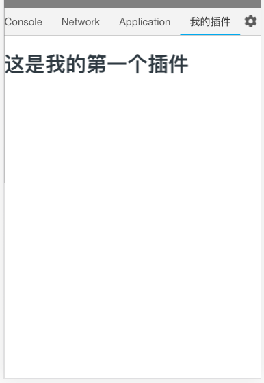
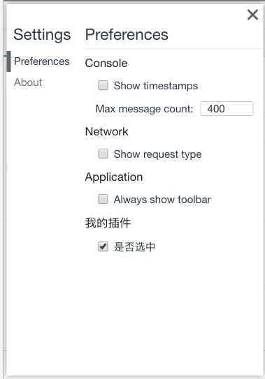
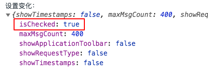

# web-console 插件开发

通过插件可以增强 web-console 的能力，扩大使用场景。web-console 插件基于 Vue 组件开发，提供了丰富的 API、生命周期方法、内置组件、自定义偏好设置，同时提供了一个初始的插件开发项目模板方便开发、测试和发布。

## 一个简单的插件示例

下面是一个简单的插件示例。

首先，创建一个文件 MyPlugin.js 用于定义插件。

```js
export default function(WebConsole, options) {
  return new WebConsole.Plugin({
    id: "myPlugin",
    name: "我的插件",
    component: {
      render(h) {
        return h("h1", null, "这是我的第一个插件");
      }
    }
  });
}
```

然后通过`WebConsole.use()`方法注册插件，当 web-console 运行起来后，插件会自动加载到主面板。

```js
// 使用插件
import WebConsole from "@whinc/web-console";
import MyPlugin from "my-plugin";

WebConsole.use(MyPlugin);
new WebConsole();
```

运行截图如下：



## 创建插件

web-console 插件是一个返回`WebConsole.Plugin`实例的函数，函数的第一个参数是`WebConsole`对象，第二个参数是传递给插件的参数。

```js
function MyPlugin(WebConsole, options) {
  return new WebConsole.Plugin({
    /*...*/
  });
}
```

`WebConsole.Plugin`类是所有插件的基类，返回的插件实例必须继承自它，它的构造函数接受一个配置参数，支持的字段及取值如下：

| 字段      | 类型         | 必填  | 备注                                 |
| --------- | ------------ | ----- | ------------------------------------ |
| id        | string       | true  | 不能与已安装的插件 id 相同           |
| name      | string       | false | 插件名称，用于显示，缺省时与 id 相同 |
| component | VueComponent | true  | 插件主面板，是一个 Vue 组件          |
| settings  | Object       | false | 增加到设置面板的设置项               |

> 参数配置中的 component 注入了一些 web-console 组件，可以直接使用。（后续补充关于这些内置组件的文档）

## 注册插件

通过`WebConsole.use()`方法注册插件。

```js
WebConsole.use(MyPlugin, {/*...*/})

new WebConsole(})
```

> 注意：插件必须在 WebConsole 实例化之前注册，否则不生效。

## 插件生命周期

目前插件支持如下生命周期方法，这些插件方法在`component`所赋值的组件中可用。

| 生命周期方法                                        | 执行时机                     | 备注                          |
| --------------------------------------------------- | ---------------------------- | ----------------------------- |
| `onWebConsoleReady(hostProxy)`                      | 主面板首次渲染完成时         | 可访问 DOM 和配置，仅执行一次 |
| `onWebConsoleShow(hostProxy)`                       | 主面板从不可见变为**可见**时 |                               |
| `onWebConsoleHide(hostProxy)`                       | 主面板从可见变为**不可见**时 |
| `onWebConsoleTabChanged(hostProxy, newTab, oldTab)` | 切换不同子面板时             |
| `onWebConsoleSettingsLoaded(hostProxy, settings)`   | 偏好设置首次加载时           |
| `onWebConsoleSettingsChanged(hostProxy, settings)`  | 偏好设置变化时               |

使用示例：

```js
export default function(WebConsole, options) {
  return new WebConsole.Plugin({
    id: "myPlugin",
    name: "我的插件",
    component: {
      render(h) {
        return h("h1", null, "这是我的第一个插件");
      },
      methods: {
        onWebConsoleShow() {
          console.log("Show");
        },
        onWebConsoleHide() {
          console.log("Hide");
        }
      }
    }
  });
}
```

## 插件偏好设置

web-console 有一个集中的偏好设置界面（点击主面板右上角的齿轮进入），插件可以在其中添加自己的偏好设置项，添加方式是在创建插件时指定`settings`属性，该属性接受一个数组，数组每个元素是一个设置描述对象。

支持的设置描述对象如下（还会支持更多）：

```js
// 复选框
{
  type: 'checkbox',
  desc: '是否开启',
  name: 'isOpen',
  value: false
}

// 下拉选择框
{
  type: "select",
  desc: "选择颜色",
  name: 'color',
  value: 'red',
  options: [
    { text: "红色", value: 'red' },
    { text: "绿色", value: 'green' },
    { text: "蓝色", value: 'blue' },
  ]
}
```

使用示例：

```js
export default function(WebConsole, options) {
  return new WebConsole.Plugin({
    id: "myPlugin",
    name: "我的插件",
    component: {
      render(h) {
        return h("h1", null, "这是我的第一个插件");
      },
      methods: {
        onWebConsoleSettingsLoaded(hostProxy, settings) {
          console.log("加载设置：", settings);
        },
        onWebConsoleSettingsChanged(hostProxy, settings) {
          console.log("设置变化：", settings);
        }
      }
    },
    settings: [
      {
        type: "checkbox",
        desc: "是否选中",
        name: "isChecked",
        value: false
      }
    ]
  });
}
```

运行截图：




