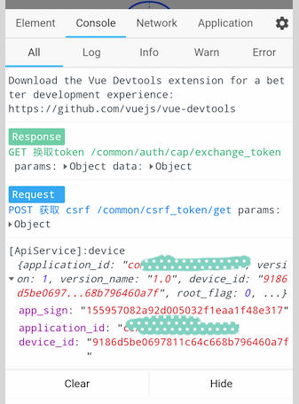

# web-console


web-console 是一款基于 H5 开发的移动端 Web 调试工具。其高度还原了 Chrome DevTools 的功能和交互，支持 webpack 打包和`<script>`方式引入。

在线演示：<https://whinc.github.io/web-console/>

CDN 地址：<https://unpkg.com/@whinc/web-console>



[更多运行截图点击这里](https://github.com/whinc/web-console/blob/master/docs/snapshot.md)

## 功能特性

web-console 特性列表完成情况（可能会变动）：

- Element 面板
  - [x] 支持 DOM 树展示
  - [x] 支持查看节点样式和计算样式
  - [x] 支持查看节点盒模型
- Console 面板
  - [x] 支持 console 对象的 log/warn/info/error/debug 方法
  - [x] 支持 log 等日志方法的多参数输出
  - [x] 支持 log 等日志方法的参数格式化输出，如`%s, %i, %d, %f, %d, %o, %O, %c`
  - [ ] 支持搜索日志
  - [ ] 支持执行 JS 代码段
- Network 面板
  - [x] 支持`XMLHttpRequest`请求和响应的展示
  - [ ] 支持`fetch`请求和响应的展示
  - [x] 支持响应数据的预览
- Application 面板
  - [x] 支持 cookie、localStorage 和 sessionStorage 的增删改查
  - [x] 支持 cookie、localStorage 和 sessionStorage 按关键字过滤
- Settings 面板
  - [x] 设置各面板默认行为
  - [x] 关于信息
- [ ] 支持插件


## 如何使用?

### 模块化方式导入

安装 npm 包

```
npm install @whinc/web-console
```

导入 web-console 并初始化

```js
import WebConsole from "@whinc/web-console";
new WebConsole();
```

或者，仅在开发模式下导入

```js
if (process.env.NODE_ENV === "development") {
  import("@whinc/web-console").then(({ default: WebConsole }) => {
    new WebConsole();
  });
}
```

### `<script>`标签导入

在 html 文件中引入 web-console（依赖 Vue 2.x）

```html
<script src="https://unpkg.com/vue"></script>
<script src="https://unpkg.com/@whinc/web-console"></script>
```

通过下面代码初始化

```js
new WebConsole();
```

## 更新日志

[CHANGELOG](CHANGELOG.md)

## License

MIT
